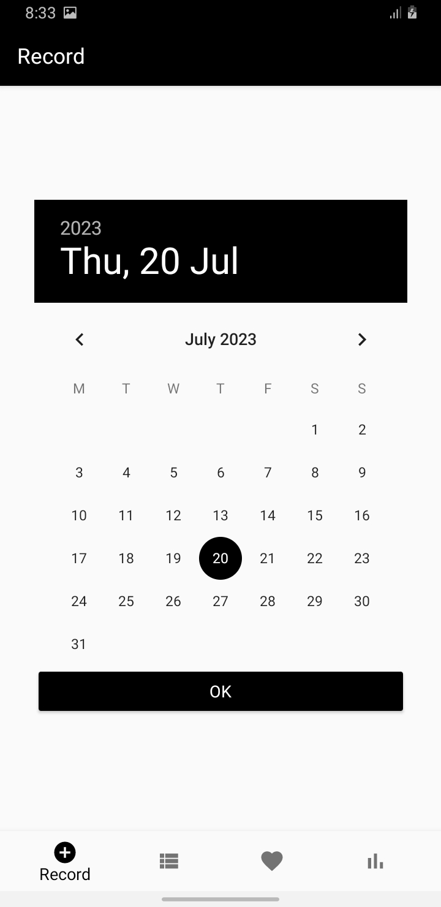

# Expense-Tracker-app
## Introduction
Managing personal finances and tracking expenses efficiently is crucial for maintaining financial stability and achieving long-term financial goals. With the rise of digital technology, expense tracking apps have become invaluable tools for individuals seeking to take control of their financial lives. This project introduces an innovative expense tracking app designed to simplify the process of expense management and enhance users' financial awareness. Our expense tracking app leverages the power of modern smartphones, providing users with a comprehensive platform to effortlessly monitor their expenses in real-time.
## Objective
- Simplify Expense Tracking
- Enhance Financial Awareness
- Facilitate Budget Management
- Provide Data Visualization and Insights (Bar chart)
## Modules in the App
- Add record with item, price and date values
- Monthly expense display
- Wishlist creation and display
- Visualization of expense through graph chart

## Below are some screenshots of the Expense-Tracker-App
 

 

 

 

 

 

 

 

 
<!-- 

 

  -->
